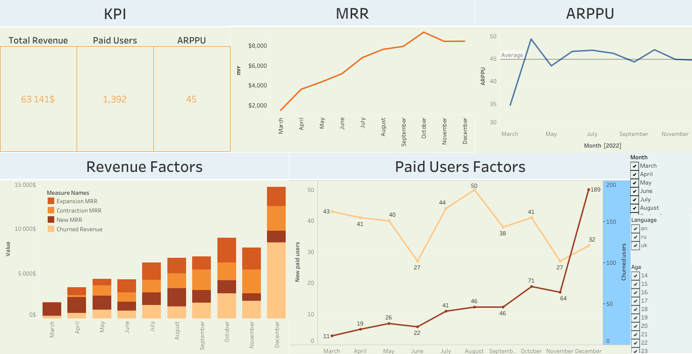

# SQL + Tableau: Subscription Metrics Dashboard (MRR / Churn)

Проєкт: дашборд для відстеження підписок і виручки.  
**SQL** рахує метрики (MRR, Paid Users, ARPPU, New/Churned/Expansion/Contraction), **Tableau** візуалізує динаміку та фактори змін.

## 🔧 Stack
- SQL (PostgreSQL): CTE, Window Functions
- Tableau (Public)

## 🗂️ Repo structure
# основний SQL-запит (метрики по місяцях)
# скрін дашборду

## 📊 Dashboard
- **KPI зверху:** MRR, Paid Users, ARPPU
- **Тренди:** MRR + Paid Users (dual axis), ARPPU
- **Фактори:** New / Expansion / Contraction / Churned MRR; New vs Churned Users
- **Фільтри:** payment_month (+ language/age за потреби)

**Посилання на дашборд:**  
[Відкрити в Tableau Public]([https://public.tableau.com/app/profile/your_profile/viz/mrr_dashboard](https://public.tableau.com/views/Revenuemetrics_17580548664470/Dashboard?:language=en-US&:sid=&:redirect=auth&:display_count=n&:origin=viz_share_link))  <!-- заміни на свій URL -->

## 📈 Метрики (коротко)
- **MRR** — сумарний revenue за місяць від повторюваних джерел
- **Paid Users**, **ARPPU** = MRR / Paid Users
- **New Paid Users**, **New MRR**
- **Churned Users**, **Churned Revenue**
- **Expansion / Contraction MRR**
- **Churn Rate** = Churned Users (місяць t) / Paid Users (місяць t-1)
- **Revenue Churn Rate** = Churned Revenue (t) / MRR (t-1)

## ▶️ Як відтворити локально (за потреби)
1) Виконати `sql/mrr_metrics.sql` у своїй БД (схема і назви колонок — приклад з мого проєкту).  
2) Підключити результат у Tableau (або CSV з результатами) і зібрати візуалізації за структурою вище.
